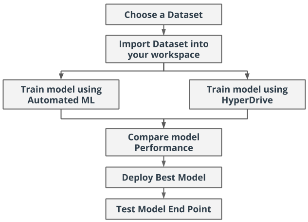
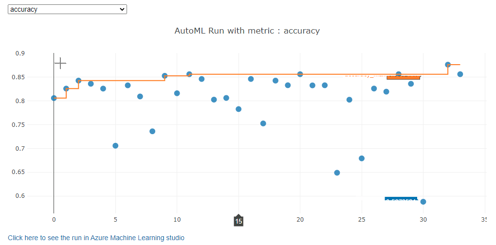

*NOTE:* This file is a template that you can use to create the README for your project. The *TODO* comments below will highlight the information you should be sure to include.

# Predicting the Probability of Mortality Caused by Heart Failure

*TODO:* Write a short introduction to your project.

This project is the final capstone project as part of Microsoft's sponsored Udacity Nanodegree programme [Machine Learning Engineer for Microsoft Azure](https://www.udacity.com/course/machine-learning-engineer-for-microsoft-azure-nanodegree--nd00333).

In this project I used an external dataset outside the Microsoft Azure environment to develop two Machine Learning models using `Azure AutoML` and `Logistic Regression model + Hyper Drive`.

>**Hyperdrive** is a Microsoft package that automate the process of choosing hyperparameters to optimize your machine learning model.

The `AutoML` model and the `Logistic Regression + Hyper Drive` models were compared and the best performing model was chosen and deployed as a webservice REST API using Azure Container Instance (ACI). The REST API endpoint is then consumed using a Python HTTP request calls to produce scoring results.

## Project Workflow diagram



*TODO: State which model performed better, giving the model name and the metrics for comparison
The `Azure Auto ML` run produced the best model with a model accuracy of `83.3` as compared to the `Logistic Regression + Hyper Drive` with a model accuracy of `79.4`.


## Project Set Up and Installation

*OPTIONAL:* If your project has any special installation steps, this is where you should put it. To turn this project into a professional portfolio project, you are encouraged to explain how to set up this project in AzureML.

This section describe how the project can be setup to run on Azure Machine Learning service in the cloud.

1. **Azure Subscription**

    In order to reproduce this experiment, you need to create an Azure ML Workspace. To create an Azure ML Workspace you need to [create a new Azure subscription](https://azure.microsoft.com/en-us/free/) or access an existing suscription if you have.

2. **Azure ML SDK and other library installation**

    Azure ML Workspace provides Azure Notebooks and a Managed environment where the required SDK is already installed for this experiment.

    you can run the code below in the azure ml notebook to make sure the SDK version corresponds to what I used in this experiment.

    ```python
    import azure.core
    print("This notebook was created using version 1.20.0 of the Azure ML SDK")
    print("You are currently using verion", azureml.core.VERSION, "of the Azure ML SDK")
    ```

    if the version is different you can run the below to upgrade to the latest version 1.20.0

    ```python
    !pip install --upgrade azureml-sdk[automl]
    ```

3. **Set up your notebook environment**
    - You need to create an Azure Machine Learning workspace, a compute instance and how to set up your notebook in Azure ML. Details can be found in the link below: [create a workspace and compute instance](https://docs.microsoft.com/en-us/azure/machine-learning/tutorial-1st-experiment-sdk-setup)

    - open the notebook terminal and run the git scrit below to import notebook and script for this experiment.

    ```bash
    git clone https://github.com/donjude/azureml-engineer-capstone.git
    ```

    - in the folder `azureml-engineer-capstone` you can run the scripts below in orderly manner.
        - **automl.ipynb** - for automl run
        - **hyperparameter_tuning.ipynb + train.py** - for Logistic regression + hyperdrive run

## Dataset

### Overview
*TODO*: Explain about the data you are using and where you got it from.

The dataset [Heart failure clinical records](https://archive.ics.uci.edu/ml/machine-learning-databases/00519/heart_failure_clinical_records_dataset.csv), used in the development of the machine learning models, comes from the **University of California, Irvin (UCI)** [Machine Learning Repository](https://archive.ics.uci.edu/ml/datasets/Heart+failure+clinical+records#).

The dataset contains 299 observations and 12 clinical features with one binary target variable `death event`. This data was collected from patients who had heart failures, during their clinical follow-up period.

The same dataset can also be found on the [Kaggle site](https://www.kaggle.com/andrewmvd/heart-failure-clinical-data?select=heart_failure_clinical_records_dataset.csv) and according to the site description about the data, it states that:
> Cardiovascular diseases (CVDs) are the number 1 cause of death globally, taking an estimated 17.9 million lives each year, which accounts for 31% of all deaths worlwide.
Heart failure is a common event caused by CVDs and this dataset contains 12 features that can be used to predict mortality by heart failure.

Below is a description of the dataset:

### Attribute Information

Thirteen (12) clinical features:

- age: age of the patient (years)
- anaemia: decrease of red blood cells or hemoglobin (boolean)
- high blood pressure: if the patient has hypertension (boolean)
- creatinine phosphokinase (CPK): level of the CPK enzyme in the blood (mcg/L)
- diabetes: if the patient has diabetes (boolean)
- ejection fraction: percentage of blood leaving the heart at each contraction (percentage)
- platelets: platelets in the blood (kiloplatelets/mL)
- sex: woman or man (binary)
- serum creatinine: level of serum creatinine in the blood (mg/dL)
- serum sodium: level of serum sodium in the blood (mEq/L)
- smoking: if the patient smokes or not (boolean)
- time: follow-up period (days)

Target variable:

- [target] death event: if the patient deceased during the follow-up period (boolean)

### Task
*TODO*: Explain the task you are going to be solving with this dataset and the features you will be using for it.

In this project I seek to predict the mortality (death event) caused by Heart failure using serveral supervised machine learning techniques to predict the binary class for the target/label `death event`. The dataset contains individual clinical information of patients as described in the data attributes above. All the features in the dataset would be used in this project.

### Access
*TODO*: Explain how you are accessing the data in your workspace.

* For Azure AutoML run the dataset is read using `Dataset.Tabular.from_delimeted_files()` from the **UCI** repository URL and registered as an Azure tabular dataset in the workspace. The registered tabular dataset is then accessed by the Azure AutoML configuration settings for the run.

* For Logistic Regression + Hyperdrive run the dataset is accessed directly from the URL in the `train.py` script using `TabularDataFactory.from_delimited_files()`


## Automated ML
*TODO*: Give an overview of the `automl` settings and configuration you used for this experiment
**Auto ML Settings and Configuration**

Below is the automl settings and the configurations set for the experiment.

| Property  | Value        | Description     |
| :------------- | :----------: | -----------: |
|  n_cross_validation | 5   | Number of K-fold cross validation to perform    |
| experiment_timeout_minutes   | 60 | This specifies how long the experiment should run in minutes |
| max_concurrent_iterations   | 2 | Maximum nmber of iterations that would be executed concurrently on the compute cluster |
| primary_metric   | accuracy | The metric that Auto ML will optimize for model selection |
| compute_target   | training_cluster | The Azure compute cluster used to run the experiment. |
| task   | classification | The type of task to run |
| training_data   | dataset | The training data used in the experiment. It contains both features and the label column to predict |
| label_column_name   | DEATH_EVENT | The target variable to predict |
| path   | project_folder | The full path to the Azure ML project folder |
| enable_early_stopping   | True | Enabled to terminate if the score is not improving in a short term |
| featurization   | auto | feature engineering, transformation, scalling and normalization set to be done automatically by Azure Auto ML |
| debug_log   | automl_errors.log | The log file to write deburg information to |

```python
# define automl settings
automl_settings = {
    "n_cross_validations": 5,
    "experiment_timeout_minutes": 60,
    "max_concurrent_iterations": 2,
    "primary_metric" : 'accuracy'
}

# define automl configuration settings
automl_config = AutoMLConfig(compute_target=training_cluster,
                             task = "classification",
                             training_data=dataset,
                             label_column_name="DEATH_EVENT",   
                             path = project_folder,
                             enable_early_stopping= True,
                             featurization= 'auto',
                             debug_log = "automl_errors.log",
                             **automl_settings
                            )
```

### Results
*TODO*: What are the results you got with your automated ML model? What were the parameters of the model? How could you have improved it?
The best model produced by the Automated ML run is `VotingEnsemble` with an accuracy metric of `87.29%`.

*TODO parameters:

The following would be done to improve the AutoML run.

1. Increase the number of cross validation to improve model accuracy.
2. experiment time out would not be specified so the Auto ML run can produce the best model at its own stipulated time.


*TODO* Remeber to provide screenshots of the `RunDetails` widget as well as a screenshot of the best model trained with it's parameters.

The screen shot below shows the experiment RunDetails widget of the various models which were created during the automl run. The best model for the experiment `VotingEnsemble` can be seen at the top of the list.



## Hyperparameter Tuning
*TODO*: What kind of model did you choose for this experiment and why? Give an overview of the types of parameters and their ranges used for the hyperparameter search

Most of the algorithms used in the AutoML run of the experiment were Tree based algorithms. I chosed Logistic Regression for this experiment because, it is an algorthm that works perfectly on binary classification tasks. It is easier to implement, interpret, and very efficient to train. Techniques to avoid overfitting such as choosing regularization value and also allow model convergence to maximize accuracy are hyperparameter values that may be intimidating to come by. Using Hyperdrive with logistic regression would be easier to search for the best hyperparameters for the model.


### Results
*TODO*: What are the results you got with your model? What were the parameters of the model? How could you have improved it?

*TODO* Remeber to provide screenshots of the `RunDetails` widget as well as a screenshot of the best model trained with it's parameters.

## Model Deployment
*TODO*: Give an overview of the deployed model and instructions on how to query the endpoint with a sample input.

## Screen Recording
*TODO* Provide a link to a screen recording of the project in action. Remember that the screencast should demonstrate:
- A working model
- Demo of the deployed  model
- Demo of a sample request sent to the endpoint and its response

## Standout Suggestions
*TODO (Optional):* This is where you can provide information about any standout suggestions that you have attempted.
